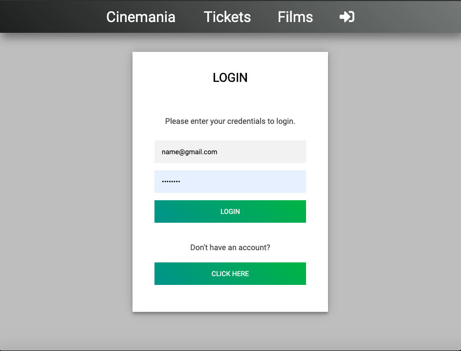
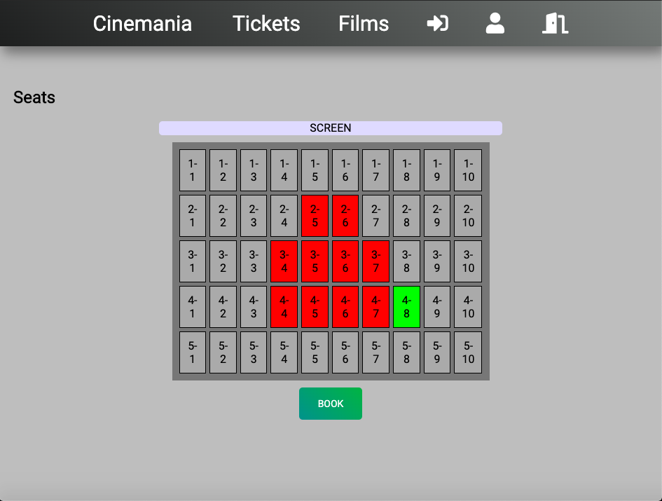
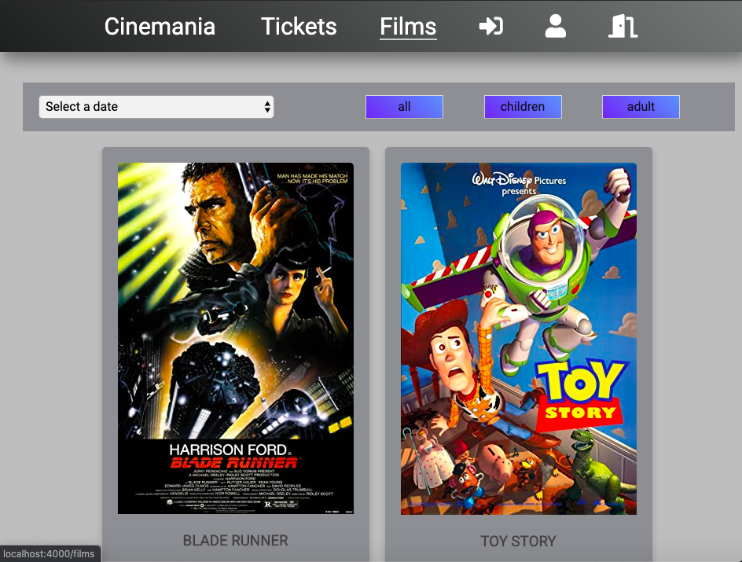

# Cinemania
> Movie theater app.

## General info
Full stack application for a movie theater with focus on functionality.

## Screenshots

## Technologies
* Vue.js
* Java Spring Framework 4.0
* SQLite

## Setup
Executable JAR-file can be made on request. 

## Code Examples
Show examples of usage:
`put-your-code-here`

## Features
* Watch trailers and read descriptions about movies.  
* Check available screening times.
* Create a user account and login to reserve seats and book tickets.
* Add new films by searching on title, get info and trailer from API's.

## Status
Project is: _finished_

## Contact
Created by Alex, Chiharu, Emmanuel and Patrik - feel free to contact us!

